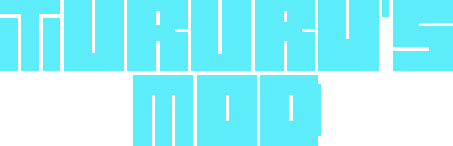
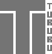
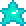
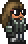

<!-- Tururu's Mod Banner -->
<h1 align="center">
    
</h1>

<!-- Project Description -->
<h4 align="center">Un simple mod para <a href="https://terraria.org/">Terraria</a> dedicado a Tururu, hecho con <a href="https://store.steampowered.com/app/1281930/tModLoader/">TModLoader</a></h4>

<!-- Poner aqui el video -->

<!-- Badges -->

  
  
  
  

<!-- Quick links -->

  <a href="#features">Características</a> •
  <a href="#showcase">Escaparate</a> •
  <a href="#todo-list">Todo List</a>

<!-- Other Badges -->
<!-- <h1>
  
  
</h1> -->
 

## Bienvenido a Tururu's Mod!

<!-- Modificar este link! -->

<b>~ Tururu's Mod ~</b>

Este mod no es mas que una extension del jugo original, independiente de otros mods, que contiene nuevas armas para todas las clases, nuevos objetos, nuevos equipables y quien sabe si NPCs. 

Todos los sprites de las armas, objetos, y demas estan hechos a mano, pixel a pixel, sin tener referencias externas. Solo imaginacion.

Una observacion del desarrollo del mod es que podria haber incluido mas cosas, pero la correccion de algunos errores que no estaban documentados 
por Tmodloader y la nula atencion de la gente de su servidor de Discord lo hace imposible.

Aparte de eso, no hay mucho mas que decir, sino que gracias  y que mas te vale. :point_up: :smirk_cat:

## Informacion

Aqui hay un adelanto de lo que incluye el mod:

- **Un arma a melee**
- **Un yoyo**
- **Una arma de magia**
- **Un baston de invocacion**
- **Un arma de rango**
- **Un boomerang**
- **Un accesorio**
- **Un NPC**
- **Una nueva rareza**
- **Un nuevo tipo de balas**
- **Dano equilibrado entre armas**
- **Armas y objetos crafteables**

## Objetos del Mod

<table>
	<tbody>
		<tr>
			<td  align="center" colspan="5"><h4 align="center">Armas</h4></td>
		</tr>
		<tr>
            <!-- Names and Links row -->
			<td align="center"><a href="Items/Weapons/Melee/TururusSword.png">Tururu's Sword</a></td>
			<td align="center"><a href="Items/Weapons/Ranged/TururusCannon.cs">Tururu's Cannon</a></td>
			<td align="center"><a href="Items/Weapons/Magic/TururusGenesis.cs">Tururu's Genesis</a></td>
			<td align="center"><a href="Items/Weapons/Magic/TururusGenesis.cs">Tururu's Yoyo</a></td>
			<td align="center"><a href="Items/Weapons//Summon/TururusStaff.cs">Tururu's Staff</a></td>
		</tr>
		<tr>
            <!-- Images row -->
			<td align="center"></td>
			<td align="center"></td>
			<td align="center"></td>
			<td align="center"></td>
			<td align="center"></td>
		</tr>
		<tr>
            <td  align="center" colspan="5">
Estadisticas
</td>
		</tr>
		<tr>
            <!-- Stats row -->
            <td> <!-- Tururus Sword  -->
                - Daño: 1010 (Melee) 
                - Knockback 30  
                - Tiempo de uso: 12  
                - Velocidad: 30  
                - Venta: 10 
            </td>
			<td> <!-- Tururus Cannon  -->
                - Daño: 1450 (A distancia) 
                - Knockback: 4  
                - Tiempo de uso: 7  
                - Velocidad: 15  
                - Venta: 10 
            </td>
			<td> <!-- Tururus Genesis  -->
                - Daño: 500 (Magia) 
                - Knockback: 8  
                - Tiempo de uso: 25  
                - Velocidad: 8  
                - Venta: 10 
            </td>
			<td> <!-- Tururus Yoyo  -->
                - Daño: 750 (Melee) 
                - Knockback: 8.5  
                - Tiempo de uso: 20  
                - Velocidad: 16  
                - Venta: 10 
            </td>
			<td> <!-- Tururus Staff  -->
                - Daño: 275 (Invocacion) 
                - Knockback: 2  
                - Tiempo de uso: 15  
                - Velocidad: 0  
                - Venta: 10 
            </td>
		</tr>
		<tr>
			<td  align="center" colspan="5">
Proyectil creado
</td>
		</tr>
        <tr>
            <!-- Projectiles row -->
			<td align="center">Tururu's Sword</td>
			<td align="center">Cannon bullet</td>
			<td align="center">Genesis Projectile</td>
			<td align="center">Tururu's Yoyo</td>
			<td align="center">Magic Star</td>
		</tr>
		<tr>
            <!-- Images row -->
			<td align="center"></td>
			<td align="center"></td>
			<td align="center"></td>
			<td align="center"></td>
			<td align="center"></td>
		</tr>
	</tbody>
</table>

<table>
	<tbody>
		<tr>
			<td  align="center"><h4>NPCs</h4></td>
		</tr>
		<tr>
			<td  align="center"><a href="NPCs/Tururu.cs">Tururu</a></td>
		</tr>
		<tr>
			<td  align="center"></td>
		</tr>
		<tr>
			<td align="center">Estadisticas</td>
		</tr>
		<tr>
			<td>
                - Tipo de IA: Pasiva 
                - Daño: 35 
                - Vida Maxima: 900 
                - Resistencia de KB: 50% 
            </td>
		</tr>
	</tbody>
</table>

## TODO List

Estas son las tareas u objetivos que estaban pensados:

- [X] Un arma Melee
- [X] Un arma de Rango 
- [X] Un arma de Magia
- [X] Un baston de invocacion
- [X] Un yoyo
- [ ] Un Boomerang
- [X] Un nuevo tipo de rareza
- [X] Un nuevo NPC
- [ ] Un accesorio
- [ ] Una mascota
