<!-- Tururu's Mod Banner -->
<h1 align="center">
    <a href="--------">
      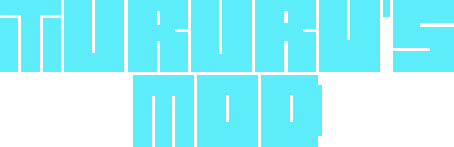
    </a>
</h1>

<!-- Project Description -->
<h4 align="center">Un simple mod para <a href="https://terraria.org/">Terraria</a> dedicado a Tururu, hecho con <a href="https://store.steampowered.com/app/1281930/tModLoader/">TModLoader</a></h4>

<!-- Badges -->

  
  
  
  

	:es: <a href="#">Español</a>
	:uk: <a href="READMEen.md">English</a>

 

<!-- Poner aqui el video -->
https://github.com/dpv927/TururusMod/assets/113710742/b433310c-3f27-455e-8d94-71cc72e50cbe
<!-- Poner aqui el video -->

<!-- Quick links -->

  <a href="#información">Información</a> •
  <a href="#objetos-del-mod">Objetos del mod</a> •
  <a href="#todo-list">TODO List</a>

 

## Bienvenido a Tururu's Mod!

<a href="--------">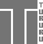</a>
<b>~ Tururu's Mod ~</b>

Este mod no es mas que una extensión del jugo original, independiente de otros mods,
que contiene nuevas armas para todas las clases, nuevos objetos, nuevos equipables y
quien sabe si NPCs.

Todos los sprites de las armas, objetos, y demás estan hechos a mano, pixel a pixel,
sin tener referencias externas. Solo con imaginación.

Una observación del desarrollo del mod es que podria haber incluido más cosas, pero
la corrección de algunos errores que no estaban documentados por Tmodloader y la nula
atención de la gente de su servidor de Discord lo ha hecho imposible.

Aparte de eso, no hay mucho más que decir, sino que gracias y que más te vale. :point_up: :smirk_cat:

## Información

Aquí hay un adelanto de lo que incluye el mod:

- **Un arma a melee**
- **Un yoyó**
- **Una arma de magia**
- **Un bastón de invocación**
- **Un arma de rango**
- **Dos accesorios**
- **Un NPC**
- **Una nueva rareza**
- **Un nuevo tipo de balas**
- **Daño equilibrado entre armas**
- **Armas y objetos crafteables**

## Objetos del Mod

<table class="armas">
	<tbody>
		<tr>
			<td  align="center" colspan="5"><h4 align="center">Armas</h4></td>
		</tr>
		<tr>
            <!-- Names and Links row -->
			<td align="center"><a href="Items/Weapons/Melee/TururusSword.png">Tururu's Sword</a></td>
			<td align="center"><a href="Items/Weapons/Ranged/TururusCannon.cs">Tururu's Cannon</a></td>
			<td align="center"><a href="Items/Weapons/Magic/TururusGenesis.cs">Tururu's Genesis</a></td>
			<td align="center"><a href="Items/Weapons/Magic/TururusGenesis.cs">Tururu's Yoyo</a></td>
			<td align="center"><a href="Items/Weapons//Summon/TururusStaff.cs">Tururu's Staff</a></td>
		</tr>
		<tr>
            <!-- Images row -->
			<td align="center"></td>
			<td align="center">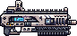</td>
			<td align="center">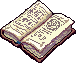</td>
			<td align="center">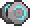</td>
			<td align="center">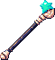</td>
		</tr>
		<tr>
            <td  align="center" colspan="5">
Estadísticas
</td>
		</tr>
		<tr>
            <!-- Stats row -->
            <td> 
				<!-- Tururus Sword  -->
                - Daño: 1010 
                - Knockback 30  
                - Tiempo de uso: 12  
                - Velocidad: 30  
                - Compra: 1 14 
				- Venta: 20 50
            </td>
			<td> 
				<!-- Tururus Cannon  -->
                - Daño: 1450 
                - Knockback: 4  
                - Tiempo de uso: 7  
                - Velocidad: 15  
                - Compra: 1 14 
				- Venta: 23 20
            </td>
			<td>
				<!-- Tururus Genesis  -->
                - Daño: 500 
                - Knockback: 8  
                - Tiempo de uso: 25  
                - Velocidad: 8  
               	- Compra: 1 14 
				- Venta: 17 54
            </td>
			<td> 
				<!-- Tururus Yoyo  -->
                - Daño: 750 
                - Knockback: 8.5  
                - Tiempo de uso: 20  
                - Velocidad: 16  
                - Compra: 1 14 
				- Venta: 17 54
            </td>
			<td> 
				<!-- Tururus Staff  -->
                - Daño: 275 
                - Knockback: 2  
                - Tiempo de uso: 15  
                - Velocidad: 0  
                - Compra: 1 14 
				- Venta: 17 54
            </td>
		</tr>
		<tr>
			<td  align="center" colspan="5">
Tipo de daño
</td>
		</tr>
		<tr>
			<!-- Tipo de dano row -->
			<td align="center">Melee</td>
			<td align="center">A distancia</td>
			<td align="center">Magia</td>
			<td align="center">Melee</td>
			<td align="center">Invocación</td>
		</tr>
		<tr>
			<td  align="center" colspan="5">
Proyectil creado
</td>
		</tr>
        <tr>
            <!-- Projectiles row -->
			<td align="center">Tururu's Sword</td>
			<td align="center">Cannon bullet</td>
			<td align="center">Genesis Projectile</td>
			<td align="center">Tururu's Yoyo</td>
			<td align="center">Magic Star</td>
		</tr>
		<tr>
            <!-- Images row -->
			<td align="center"></td>
			<td align="center"></td>
			<td align="center">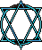</td>
			<td align="center">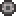</td>
			<td align="center">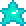</td>
		</tr>
	</tbody>
</table>

<table class="accesorios">
	<tbody>
		<tr><td  colspan="2" align="center"><h4>Equipables</h4></td></tr>
		<tr>
			<td  align="center"><a href="Items/Accessories/HeavyGamingMouse.cs">Heavy Gaming Mouse</a></td>
			<td  align="center"><a href="Items/Accessories/LightGamingMouse.cs">Light Gaming Mouse</a></td>
		</tr>
		<tr>
			<td  align="center">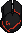</td>
			<td  align="center">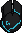</td>
		</tr>
		<tr>
			<td colspan="2" align="center">Estadísticas</td>
		</tr>
		<tr>
			<td>
                - Multiplicador de aceleración: 2.86 
                - Modificador de velocidad: 55.5% 
				- Inmunidad a la lava  
				- Compra: 7  98  
				- Venta: 1  22  80 
            </td>
			<td>
                - Multiplicador de aceleración: 3.05 
                - Modificador de velocidad: 77% 
				- Inmunidad a la lava  
				- Compra: 11  40  
				- Venta: 1  75  43 
            </td>
		</tr>
	</tbody>
</table>

<table class="NPCs">
	<tbody>
		<tr><td align="center"><h4>NPCs</h4></td></tr>
		<tr><td align="center"><a href="Assets//Tururu.cs">Tururu</a></td></tr>
		<tr><td align="center">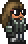</td></tr>
		<tr><td align="center">Estadísticas</td></tr>
		<tr>
			<td>
                - Tipo de IA: Pasiva 
                - Daño: 35 
                - Vida Máxima: 900 
                - Resistencia de KB: 50% 
            </td>
		</tr>
	</tbody>
</table>

## TODO List

Estas son las tareas u objetivos que estaban pensados 
y actualmente estan completados o por completar:

- [X] Un arma Melee
- [X] Un arma de Rango 
- [X] Un arma de Magia
- [X] Un bastón de invocación
- [X] Un yoyó
- [ ] Un Boomerang
- [X] Un nuevo tipo de rareza
- [X] Un nuevo NPC
- [X] Un accesorio
- [ ] Una mascota
