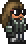

# Tururu's Mod

# Weapons

| Preview | Name | Damage Type | Projectiles |
| ------- | ------ | ------- | ------- |
|    | <a href="Items/Weapons/Melee/TururusSword.png">Tururu's Sword</a>    | Melee  |    | 
|  | <a href="Items/Weapons/Ranged/TururusCannon.cs">Tururu's Cannon</a>  | Ranged |  |
|  | <a href="Items/Weapons/Magic/TururusGenesis.cs">Tururu's Genesis</a> | Magic  |  | 
|     | <a href="Items/Weapons/Magic/TururusGenesis.cs">Tururu's Yoyo</a>    | Melee  |     |
|   | <a href="Items/Weapons//Summon/TururusStaff.cs">Tururu's Staff</a>   | Summon | - |

# NPCs

| Preview | Name |
| ------- | ------ |
|  | <a href="NPCs//Tururu.cs">Tururu</a> | 

## TODO List

- [X] Melee Weapon
- [X] Ranged Weapon 
- [X] Magic Weapon
- [ ] Summon Staff
- [X] Yoyo
- [ ] Boomerang
- [X] A new Rarity
- [X] A new NPC
- [ ] A new Accessory
- [ ] A new pet
