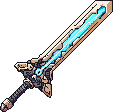

<!-- Overview -->
<h1 align="center">
   
    <!-- Logo -->
    
   
  <!-- Project Name -->
  <!-- TururusMod -->
</h1>

<!-- Project Description -->
<h4 align="center">A simple <a href="https://terraria.org/">Terraria</a> mod dedicated to Tururu made with <a href="https://store.steampowered.com/app/1281930/tModLoader/">TModLoader</a></h4>

<!-- Badges -->

  
  
  
  

<!-- Quick links -->

  <a href="#features">Features</a> •
  <a href="#showcase">Showcase</a> •
  <a href="#todo-list">Todo List</a>

# Features

* Un nuevo arma para cada clase del juego.
* Las armas y projectiles tienen un deseno unico.
* Todas las armas tienen un dano equilibrado entre si.
* Nuevo tipo de municion.
* Un nuevo tipo de rareza de objetos.
* Un nuevo NPC.
* Puedes comprar las nuevas armas y municiones al NPC.
* Todas las armas y municion se pueden craftear.

# Showcase

## Weapons

| Preview | Name | Damage Type | Projectiles |
| ------- | ------ | ------- | ------- |
|    | <a href="Items/Weapons/Melee/TururusSword.png">Tururu's Sword</a>    | Melee  |    | 
|  | <a href="Items/Weapons/Ranged/TururusCannon.cs">Tururu's Cannon</a>  | Ranged |  |
|  | <a href="Items/Weapons/Magic/TururusGenesis.cs">Tururu's Genesis</a> | Magic  |  | 
|     | <a href="Items/Weapons/Magic/TururusGenesis.cs">Tururu's Yoyo</a>    | Melee  |     |
|   | <a href="Items/Weapons//Summon/TururusStaff.cs">Tururu's Staff</a>   | Summon |                |

## NPCs

| Preview | Name |
| ------- | ------ |
|  | <a href="NPCs//Tururu.cs">Tururu</a> | 

## TODO List

- [X] Melee Weapon
- [X] Ranged Weapon 
- [X] Magic Weapon
- [X] Summon Staff
- [X] Yoyo
- [ ] Boomerang
- [X] A new Rarity
- [X] A new NPC
- [ ] A new Accessory
- [ ] A new pet
