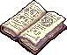
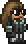

<!-- Tururu's Mod Banner -->
<h1 align="center">
    
</h1>

<!-- Project Description -->
<h4 align="center">A simple mod for <a href="https://terraria.org/">Terraria</a> dedicated to Tururu, made with <a href="https://store.steampowered.com/app/1281930/tModLoader/">TModLoader</a></h4>

<!-- Badges -->

  
  
  
  

	:es: <a href="https://github.com/dpv927/TururusMod/tree/main">Español</a>
	:uk: <a href="#">English</a>

 

<!-- Poner aqui el video -->
<!-- Poner aqui el video -->

<!-- Quick links -->

  <a href="#information">Information</a> •
  <a href="#mod-objects">Mod Objects</a> •
  <a href="#todo-list">TODO List</a>

 

## Welcome to Tururu's Mod!

<b>~ Tururu's Mod ~</b>

This mod is nothing more than an extension of the original game, independent of other mods,
containing new weapons for all classes, new items, new equipables and, who knows if NPCs.

All weapon sprites, items, and so on are handmade, pixel by pixel,
with no external references. Only with imagination.

One observation from the development of the mod is that it could have included more things, but
the correction of some bugs that were not documented by Tmodloader and the lack of
attention of the people on his Discord server has made it impossible.

Other than that, there's not much more to say, but thank you. :point_up: :smirk_cat:

## Información

Here's a preview of what's included in the mod:

- **A melee weapon**
- **A yo-yo**
- **A magic weapon**
- **A summoning staff**
- **A ranged weapon**
- **Two accessories**
- **One NPC**
- **A new rarity**
- **A new bullet type**
- **Balanced damage between weapons**
- **Craftable weapons and items**

## Mod Objects

<table class="armas">
	<tbody>
		<tr>
			<td  align="center" colspan="5"><h4 align="center">Weapons</h4></td>
		</tr>
		<tr>
            <!-- Names and Links row -->
			<td align="center"><a href="Items/Weapons/Melee/TururusSword.png">Tururu's Sword</a></td>
			<td align="center"><a href="Items/Weapons/Ranged/TururusCannon.cs">Tururu's Cannon</a></td>
			<td align="center"><a href="Items/Weapons/Magic/TururusGenesis.cs">Tururu's Genesis</a></td>
			<td align="center"><a href="Items/Weapons/Magic/TururusGenesis.cs">Tururu's Yoyo</a></td>
			<td align="center"><a href="Items/Weapons//Summon/TururusStaff.cs">Tururu's Staff</a></td>
		</tr>
		<tr>
            <!-- Images row -->
			<td align="center"></td>
			<td align="center"></td>
			<td align="center"></td>
			<td align="center"></td>
			<td align="center"></td>
		</tr>
		<tr>
            <td  align="center" colspan="5">
Stats
</td>
		</tr>
		<tr>
            <!-- Stats row -->
            <td> 
				<!-- Tururus Sword  -->
                - Damage: 1010 
                - Knockback: 30  
                - Use time: 12  
                - Speed: 30  
                - Purchase: 1 14 
				- Sell: 20 50
            </td>
			<td> 
				<!-- Tururus Cannon  -->
                - Damage: 1450 
                - Knockback: 4  
                - Use time: 7  
                - Speed: 15  
                - Purchase: 1 14 
				- Sell: 23 20
            </td>
			<td>
				<!-- Tururus Genesis  -->
                - Damage: 500 
                - Knockback: 8  
                - Use time: 25  
                - Speed: 8  
               	- Purchase: 1 14 
				- Sell: 17 54
            </td>
			<td> 
				<!-- Tururus Yoyo  -->
                - Damage: 750 
                - Knockback: 8.5  
                - Use time: 20  
                - Speed: 16  
                - Purchase: 1 14 
				- Sell: 17 54
            </td>
			<td> 
				<!-- Tururus Staff  -->
                - Damage: 275 
                - Knockback: 2  
                - Use time: 15  
                - Speed: 0  
                - Purchase: 1 14 
				- Sell: 17 54
            </td>
		</tr>
		<tr>
			<td  align="center" colspan="5">
Type of damage
</td>
		</tr>
		<tr>
			<!-- Type de dano row -->
			<td align="center">Melee</td>
			<td align="center">Ranged</td>
			<td align="center">Magic</td>
			<td align="center">Melee</td>
			<td align="center">Summon</td>
		</tr>
		<tr>
			<td  align="center" colspan="5">
Created Projectile
</td>
		</tr>
        <tr>
            <!-- Projectiles row -->
			<td align="center">Tururu's Sword</td>
			<td align="center">Cannon bullet</td>
			<td align="center">Genesis Projectile</td>
			<td align="center">Tururu's Yoyo</td>
			<td align="center">Magic Star</td>
		</tr>
		<tr>
            <!-- Images row -->
			<td align="center"></td>
			<td align="center"></td>
			<td align="center"></td>
			<td align="center"></td>
			<td align="center"></td>
		</tr>
	</tbody>
</table>

<table class="accesorios">
	<tbody>
		<tr><td  colspan="2" align="center"><h4>Accesories</h4></td></tr>
		<tr>
			<td  align="center"><a href="Items/Accessories/HeavyGamingMouse.cs">Heavy Gaming Mouse</a></td>
			<td  align="center"><a href="Items/Accessories/LightGamingMouse.cs">Light Gaming Mouse</a></td>
		</tr>
		<tr>
			<td  align="center"></td>
			<td  align="center"></td>
		</tr>
		<tr>
			<td colspan="2" align="center">Stats</td>
		</tr>
		<tr>
			<td>
                - Acceleration multiplier: 2.86 
                - Speed modifier: 55.5% 
				- Lava immunity 
				- Purchase: 7  98  
				- Sell: 1  22  80 
            </td>
			<td>
                - Acceleration multiplier: 3.05 
                - Speed modifier: 77% 
				- Lava immunity 
				- Purchase: 11  40  
				- Sell: 1  75  43 
            </td>
		</tr>
	</tbody>
</table>

<table class="NPCs">
	<tbody>
		<tr><td align="center"><h4>NPCs</h4></td></tr>
		<tr><td align="center"><a href="Assets//Tururu.cs">Tururu</a></td></tr>
		<tr><td align="center"></td></tr>
		<tr><td align="center">Stats</td></tr>
		<tr>
			<td>
                - IA Type: Pasive 
                - Damage: 35 
                - Haximum health: 900 
                - KB resistance: 50% 
            </td>
		</tr>
	</tbody>
</table>

## TODO List

These are the tasks or objectives that were planned and are currently 
and are currently completed or to be completed:

- [X] A Melee Weapon
- [X] A Ranged weapon 
- [X] A Melee weapon
- [X] A summoning staff
- [X] A yo-yo
- [ ] A Boomerang
- [X] A new type of rarity
- [X] A new NPC
- [X] An accessory
- [ ] A pet